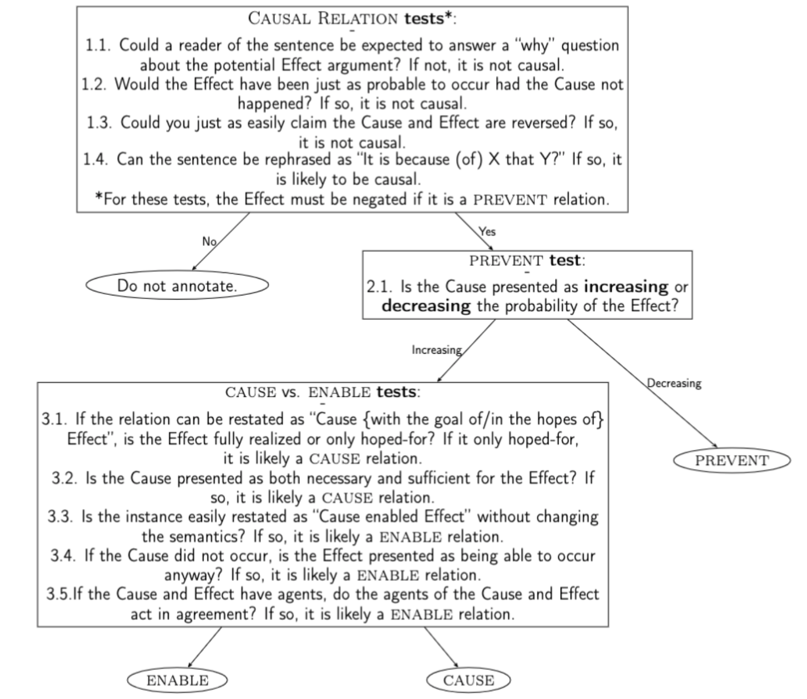

# Causal Relation (CR) Annotation Guidelines

The purpose of this project is to generate consistent document-level annotation of causal relations based on pre-identified connectives in the Constructicon and Wolff’s categories of causation. This project is heavily inspired by Dunietz's (2018) annotation guidelines for the [BECAUSE](https://github.com/duncanka/because) (Bank of Effects and Causes Stated Explicitly) corpus.

## 1. Overview of causal linguistic constructions
We first define an _affector_ as an entity that acts on another entity, and a _patient_ as an entity that is acted on by another entity (Wolff et al. 2005). Previous work in causal language has arranged causal linguistic constructions on a spectrum of specificity. At a high level, from least to most specific, this includes:

1. _Affect_ verbs such as _affect_, _influence_, and _determine_, which specify only the occurrence of some change. 
2. _Link_ verbs such as _link to_, which differ from _affect_ verbs in that they specify that a result was achieved.
3. Causal connectives and prepositions including _because_, _after_, and _when_. 
4. Periphrastic (indirect) causatives such as _cause to_ and _prevent from_, which are typically matrix verbs that take an object and clausal complement, sometimes add a specification of affector-patient concordance (i.e., _allow_ specifies that the patient’s tendency was towards the result encouraged by the affector).
5. Lexical causatives such as _kill_ and _bake_ which imply direct causation.
6. Resultative constructions such as _hammered the metal flat_ which also incorporate the means of causation along with a periphrastic or lexical causative.

The majority of annotation instances indicated by the Constructicon is concerned with the middle of this spectrum. While much theoretical work is concerned with lexical causatives, we exclude these relations from our annotations. As with Dunietz (2018), this is because our definition of **Annotatable Causal Language** refers to clauses or phrases in which one event, state, action, or entity (the Cause) is **explicitly presented as** promoting or hindering another (the Effect). Both “explicit” and “presented as” are separately essential to our definition. The Cause and Effect must be deliberately related by an explicit trigger, which we term the Connective. As a consequence, our work refrains from annotating:

1. Causal relationships with no lexical trigger: I.e., _A robber set upon them. They ran away._
2. Connectives that encode the means or the result of the causation: I.e., _kill_ can be interpreted as _cause to die_, but since this encodes the result, we do not annotate it. Furthermore, _paint_ in _John painted the house red_ encodes the Means, and so we exclude it. 
3. Connectives that assert an unspecified causal relationship: I.e., _Linked_ in _Smoking is linked to cancer_ does not explicitly specify the direction of causation, so we do not annotate it.

The decision to exclude the above instances of causal languages was made so that we may focus specifically on language that only expresses causation. If we were to include the above instances, the majority of transitive verbs in the English language would be considered causal, and it would be close to impossible to disentangle causation as a semantic phenomenon from its means or effect.

## 2. Annotatable Units 
- The **Causal Connective** is a word or series of words that encodes the causal relationship. Generally, the connective consists of a fixed construction with some open slots (e.g. _because_). Modifiers of the connective are not annotated (i.e., only _inhibits_ in _severely inhibits_ is annotated). Every causal connective should also be annotated with the instance’s classification information -- specifically, its degree of causation. The arguments of the causal connective, each of which may or may not be present, form the rest of each annotation instance. We define an **annotation instance** as each instance of a Causal Connective that has either (or both) a Cause and Effect, and may also include a Means. The connective spans are pre-identified in the Constructicon.

- The **Effect** is the span that presents an outcome. It should be either a complete phrase or clause, though the clause may be non-finite (i.e., the subject may be missing and the verb may be a participle, gerund, or infinitive). Only in exception 4.2.9. below can the Effect argument not be a complete phrase or clause.

- The **Cause** is the span of text that presents an event, state, or entity that produces the effect. This should also be either a complete phrase or clause.

- The **Means** of causation is annotated when the activity by which the Cause (an entity or event) produced the Effect is also specified. I.e., in "The men kept the fire from spreading by clearing large ditches around it", _the men_ should be annotated as the Cause, and _clearing large ditches around it_ as the Means. 
	Conceptually, the Means is a part of the Cause, but we annotate it separately because Means clauses make use of distinct linguistic machinery. Means arguments should only be annotated for:
	<!--1. _by_ or _via_ clauses
	2. dependent clauses like _**Singing loudly**, she caused pain for everyone around_.
	3. _how_ phrases (e.g., _**That**’s how I almost caused a war_.)
	4. _when_ phrases (e.g., _I started a fire when **I dropped the match**_.)-->

<ol type="1">
  <li> <i>By</i> or <i>via</i> clauses
    <ol type="1">
      <li> [You] can [make] [it easier to eat home-cooked meals] by [meal-prepping on the weekends Means]. </li>
      <li> [I] [guaranteed] [her the results she wanted] via [legal contract Means]. </li>
	<li> By [always leaving the window open Means], [she] accidentally [fostered] [the growth of mold].</li>
    </ol>
  </li>
 <li>  <i>How</i> phrases </li>
    <ol type="1">
      <li> [That Means]'s how [I] almost [caused] [a war]. </li>
    </ol>
  </li>
  <li>  <i>When</i> phrases </li>
    <ol type="1">
      <li>[I] [caused] [a fire] when [I dropped the match Means].</li>
    </ol>
  </li>
  <li> Certain other dependent clauses </li>
    <ol type="1">
	   <li> [I] [forced] [myself] [to] [study regularly in college] [through incentives like Starbucks]. </li>
	    <li> [Singing loudly Means], [she] [caused] [pain for everyone around]. </li>
    </ol>
  </li>
</ol>

As in examples 1.1.-1.3., _by_ or _via_ are not included in the span of the Means. Annotators may observe that _by_ is also an entry in the Constructicon. _By_ clauses thus include Means when the arguments are not in a causal relation -- i.e., in example 1.1., _meal-prepping_ is temporally instantaneous with _making it easier to eat home-cooked meals_.

In the case that any of the above instances of Means occur without a separate connective that does not trigger a Means, we do not annotate it. I.e., we would not annotate _By screaming too hard, she ruptured her vocal chords_.

<!--	5. Purpose instances where the Cause is itself a causal instance (e.g. _I **spoke with him** to prevent him from getting mad_, where _I_ and _spoke with him_ are the Cause and Means, respectively, for a PREVENT relation). 
		- Consider that _I spoke with him to prevent him from getting mad_, can be rephrased as, _I spoke with him with the goal of preventing him from getting mad_. More generally, Purpose constructions can generally be rephrased as: _Cause {in the hopes of/with the goal of} Effect_, where the Effect is only hoped-for and not fully realized.
			- Consider the above generalization with a counterexample of a non-Purpose instance: _Should you wish to cancel your order, please 				contact the customer service department_. Here, _Contact the customer service department with the goal of you wishing to cancel your order_ does not make sense. 
		- However, note that in the subcase of Purpose where the Cause is not a causal instance (i.e., _Maggie went to the store to buy eggs_) we do not annotate a Means. So, the entire [Maggie went to the store] would be annotated as Cause only. To differentiate these two subcases of Purpose, try restating (with appropriate changes in tense) it as _[Affector] [Connective] [Effect] by [Possible Means]_. Since _I spoke with him to prevent him from getting mad_ can be rephrased as _I prevented him from getting mad by speaking with him_, it passes the test and thus has a causal Cause for which a separate Means should be annotated. However, _Maggie to buy eggs went to the store_ sounds a bit funky and fails the test.
	7. constructions like _use Means to cause Effect_ and _Cause does Means to cause Effect_ (e.g., _The stripes and polka dots **combine** to create a sense of discord_).
-->

## 3. Causation classification 
The main task of this project is to classify annotation instances into three categories of causation: CAUSE, ENABLE, and PREVENT. Generally, past work on causation proposed that causal relations are inferred on the basis of _covariation_, which describes when two events are likely to co-occur. Covariation is calculated by subtracting the probability of an effect _e_, in the presence of a candidate cause _c_, from the probability of the effect in the absence of _c_. This is defined as ∆P = P(e|c) - P (e|not(c)). A causal relation is inferred when P(e|c) > P(e|not(c)). For example, the probability of cancer in the presence of smoking is greater than in the absence of smoking, licensing the statement “smoking causes cancer” (Wolff, Song, and Driscoll 2002). To simplify this judgment task, we offer (1) the Constructicon, which pre-identifies the majority of connectives that _may_ indicate the presence of a causal relation, and (2) the following tests.
	
1. **The “why” test**: After reading the sentence, could a reader reasonably be expected to answer a “why” question about the potential Effect argument? If not, it is probably not causal.
2. **The counterfactuality test**: Would the Effect have been just as probable to occur had the Cause not happened? If so, it is probably not causal.
3. **The ontological asymmetry test**: Could you just as easily claim the Cause and Effect are reversed? If so, it is probably not causal.
4. **The linguistic test**: Can the sentence be rephrased as “It is because (of) _X_ that _Y_?” If so, it is likely to be causal.

Now, we discuss our subcategories of causation. Generally, there is a temporal constraint on causal roles; i.e. in A {causes/enables/prevents} B, some part of A must occur before B. The only exception to this case are Purpose cases (more on Purpose cases in section 4). Consider the following:

> I work a job because I need to pay rent and tuition myself.

Although it is not abundantly clear here whether "work" or the "need" occurred first, since we may reason that the sole purpose of _working a job_ is because the patient _needs to pay rent and tuition_, we would annotate this as:
	
**[I work a job Effect] [because Causing] [I need to pay rent and tuition myself Cause]**.
	
### 3.1. Overview of categories
We include the below representations of CAUSE, ENABLE, and PREVENT to be of use to annotators. 

| |      Patient tendency for result     | Affector-patient concordance | Occurrence of result | 
|---------------|---------------|-----------------------------|-------------------|
|CAUSE | No | No | Yes |
|ENABLE | Yes | Yes | Yes |
|PREVENT | Yes | No | No |

#### 3.1.1. CAUSE
To reiterate, A is a CAUSE of B if:

1. The patient does not have a tendency for B
2. The affector and patient do not act in concordance
3. The result B actually occurs

Let’s discuss this in layman’s terms. Consider (1) in terms of this example:

> A deer suddenly sprinted out of left field, causing me to stomp on the brakes.

The patient in this situation is the narrator, who in the context of this piece of text, does not have a proclivity for _stomping on the brakes_; it is the action of the deer, the affector, which guarantees the result. Since the affector and the patient are at odds with each other, they (2) do not act in concordance. Finally, from the context of the situation, it is clear that (3) the result of _stomping on the brakes_ actually occurs. Thus, this is a CAUSE relation. We would annotate it like so:
	
**[A deer suddenly sprinted out of left field Cause], [causing Causing] [me to stomp on the brakes Effect].**

Note that there cases of CAUSE that may be tricky to identify because of point 3. Consider the following statement, which depicts a Purpose instance of CAUSE:

> I searched for jobs in order to make money. 

[I searched for jobs Cause] [in order to Causing] [make money Effect].

Annotators may see that it is not entirely certain that the Effect actually occurs. However, if they restrict their reasoning to only include possible worlds where _the effect actually occurs_, it is easy to see that in these worlds, the job search was a CAUSE of making money. 
	
For annotators’ sake, we introduce several **CAUSE tests**: 

1. If the relation can be restated as "Cause _{in the hopes of/with the goal of} Effect_", so that the purpose of Cause is to bring about the Effect, it is likely a CAUSE-type relation.
2. Is the Cause presented as both necessary and sufficient for the Effect? If so, it is likely a CAUSE-type relation.
	
#### 3.1.2. ENABLE

We reiterate that A ENABLES B if

1. The patient has a tendency for B
2. The affector and patient act in concordance
3. The result B actually occurs

Consider the following example:
	
> Yesterday, Betty allowed me to go to the store.
	
**Yesterday, [Betty Cause] [allowed Enabling] [me Effect] [to Enabling] [go to the store Effect].**
	
In the above example, _yesterday_ is not annotated as it does not modify a particular argument, but rather the entire annotation instance. Now consider a similar version:
	
> Betty allowed me to go to the store, and so yesterday I did.
	
Note that since the Cause argument itself includes a causal instance, annotating this statement would entail annotating an embedded annotation instance (_Betty allowed me to go to the store_) within a larger annotation instance (only the outer instance is demonstrated below).
	
**[Betty allowed me to go to the store Cause], and [so Enabling] [yesterday I did Effect].**
	
We introduce several **ENABLE tests**: 

1. If the Cause did not occur, is it possible that the Effect may have occurred anyway? If so, it is likely an ENABLE-type relation. 
2. If the Cause and Effect have agents, do the agents of the Cause and Effect act in agreement? (i.e., both _I_'s in _If I go to the store, I will buy milk_  have the same will to buy milk if they go to the store.) If so, it is likely an ENABLE-type relation.
3. Is the instance easily restated as “Cause enabled Effect” without any change in semantics? If so, it is likely an ENABLE-type relation. 

#### 3.1.3. PREVENT
	
To reiterate, A PREVENTS B if

1. The patient has a tendency for B
2. The affector and patient do not act in concordance
3. The result B has a reduced likelihood of occurring due to A

Consider the following example:
  
> I was studying until Jacky began screaming.
  
**[I was studying Effect] [until Preventing] [Jacky began screaming Cause].**

We introduce the **PREVENT test**: A PREVENTS B if A reduces the likelihood of B occurring. Consider the following scenario:

>  Her sense of modesty deters her from speaking up.
	
**[Her sense of modesty Cause] [deters Preventing] [her Effect] [from Preventing] [speaking up Effect].**

The following example is tricky:

> I unsuccessfully attempted to dissuade my father from purchasing another car.

Annotators may be tempted to annotate it, since there is a similar entry in the Constructicon for “discourages”. However, negated connectives are tricky. As per 4.1.1., sometimes connectives are negated to indicate that a causal relationship does not hold, which is the case in the former example. So, we would not annotate this. However, the following example provides a negated connective in which there is a causal relationship.

> The feeder discourages squirrels from stealing seeds.
	
**[The feeder Cause] [discourages Preventing] [squirrels Effect] [from Preventing] [stealing seeds Effect].**

Note that it is not the case that negation in the Effect guarantees that the relation is PREVENT-type. Causal classification should thus be dependent on both the Causal Connective and the annotator’s reasoning using the Decision Tree provided below. 

### 3.2. Distinguishing Positive from Negative Covariation (Prevent vs. Cause/Enable)
	
This part is not so important since it is already provided by the Constructicon. So, differentiating CAUSE from ENABLE is a central task for annotators.

### 3.3. Distinguishing Causing from Enabling
	
Consider that it is natural to say _lightning causes fire_ while _oxygen causes fire_ sounds quite odd (Wolff, Klettke, Ventura & Song, 2005; Ni, 2012). To distinguish the notion of CAUSE from ENABLE, we introduce _focal sets_. Focal sets are defined as contextually determined sets of events that reasoners use when determining whether two events are causally linked (Cheng and Novick 1991, 1992). A causal relation is perceived as Enabling when the candidate causal factor is constantly present in the reasoner’s focal set of events, which makes P (e|not(c)) undefined. However, the candidate causal factor must also covary positively in another focal set. Referring back to our oxygen and lightning example, oxygen is present in both the case where a forest fire occurs and when it doesn’t. However, in another focal set such as oxygen-free chambers in chemistry labs, the presence of oxygen does in fact covary with the hypothetical occurrence of a fire. Since oxygen covaries with fires in this other focal set of events, oxygen ENABLES rather than CAUSES fires. 

### 3.4. Decision tree for causation classification	
Consider the below tree for a quick summary of the above discussion:

Note that tests 3.1.-3.5. are arranged hierarchically. For example, if a causal instances passes both 3.1. and 3.3., we prioritize the positive result from 3.1. (thus, CAUSE) because 3.1. holds more weight than 3.3.

Further note that for testing whether a PREVENT connective is causal using questions 1.1.-1.4. the Effect must be negated before being entered into the subsequent span in order for the test to work. (I.e. in _Her sense of modesty forbids her from speaking up_, test 1.1. would be: Why did she not speak up? Because of her sense of modesty.)

We also provide fill-in versions of the tests in the tree in order to aid annotators' reasoning. 
<ol type="1">
  <li>Causal relation tests
    <ol type="1">
      <li> Could you ask Q: <i>Why did [Effect] occur?</i> with the expected response A: <i>Because of [Cause]</i>?</li>
      <li>[Effect] {is/is not} just as likely to occur if [Cause] did not.</li>
      <li>Does <i>[Effect] [Connective] [Cause]</i> make sense?</li>
      <li>Can you rephrase it as <i>It is because (of) [Cause] that [Effect]</i>?</li>
    </ol>
  </li>
  <li>PREVENT test</li>
    <ol type="1">
	    <li>[Cause] {increases/decreases} the probability of [Effect].</li>
    </ol>
  </li>
 <li> CAUSE vs. ENABLE tests</li>
    <ol type="1">
	<li>If you can rephrase it as <i>[Cause] {in the hopes of/with the goal of} [Effect]</i>, is the Effect {fully realized/hoped-for}?</li>
	<li>Is it true that <i>[Cause] is necessary and sufficient for [Effect]</i>?</li>
      <li>Can you rephrase it as <i>[Cause] enabled [Effect]</i>?</li>
      <li>Is it true that <i>It is possible for [Effect] to occur without [Cause]</i>?</li>
      <li>If Cause and Effect have agents, is it true that <i>The agent of [Cause] and the agent of [Effect] have similar goals in mind</i>?</li>
    </ol>
  </li>
</ol>

Here we provide an example of using this tree and its fill-in frames. Consider the following statement and its annotation:

> Their belligerence provoked a war.

**[Their belligerence Cause] [provoked ?] [a war Effect].**

Strictly following the decision tree, we start with tests 1.1. to 1.4. Note that if it fails a binary test, the result is **inconclusive**.

<ol type="1">
  <li>Causal relation tests
    <ol type="1">
      <li>Why was there a war? Because of their belligerence. ⟶ Yes, it is causal.</li>
      <li>The Effect is not as likely to occur without the occurrence of the Cause. ⟶ Yes, it is causal.</li>
      <li><i>A war provoked their belligerence</i> does not mean the same thing. ⟶ Yes, it is causal.</li>
      <li>The sentence can be rephrased as <i>It is because of their belligerence that a war occurred</i>. ⟶ Yes, it is causal.</li>
    </ol>
  </li>
  <li>PREVENT test</li>
    <ol type="1">
	    <li><i>Their belligerence</i> increases the probability of <i>a war</i>. ⟶ This is a CAUSE or ENABLE relation.</li>
    </ol>
  </li>
 <li> CAUSE vs. ENABLE tests</li>
    <ol type="1">
      <li>This cannot be rephrased as <i>They were belligerent {in the hopes of/with the goal of} a war</i>. ⟶ likely CAUSE</li>
      <li><i>Their belligerence</i> is presented as both necessary and sufficient for <i>a war</i>. ⟶ Likely CAUSE</li>
      <li><i>Their belligerence enabled a war</i> does not have the same meaning. ⟶ Inconclusive</li>
      <li>If <i>their belligerence</i> did not occur, the statement does not present <i>a war</i> as able to occur anyway. ⟶ Inconclusive</li>
      <li>This test does not hold because it is not clear that the affector and patient are the same.</li>
    </ol>
  </li>
</ol>

It is clear through the progression of the tests that CAUSE is the most likely relation. So, we finalize the annotation as: 

**[Their belligerence Cause] [provoked Causing] [a war Effect].**

However, in practice, the process of annotating is much simpler. Once a Causal Relation has been established using the Constructicon and tests 1.1.-1.4., annotators are then able to consult the Constructicon for whether the relation is PREVENT or CAUSE/ENABLE. So, annotators thus only have to decide between ENABLE and CAUSE once a causal relation is established.    
	
## 4. Edge cases

First of all, note that for both connectives and arguments, punctuation is not included in the span of the annotation unless it cannot be avoided (i.e., it is within an argument as in example 6.2.).

### 4.1. Special cases of connectives
	
1. **Negations**: Connectives may be negated to say that the indicated causal relationship does not hold -- for example, _This will not lead to the same disastrous consequences_. However, if even with the negated connective, a causal relation still holds, then these negations should be ignored for the purposes of annotation; the negation is simply another modifier. 
2. **Conjunctions**: If there are two different connectives related by a conjunction, two different annotations should be created -- one for each connective. See example 6.4.
	- This does not apply to arguments -- if there is a single connective but one or both of the arguments consist of two or more phrases or clauses connected by a conjunction, the entire conjoined argument phrase should be annotated as the argument of a single causation instance. The same holds for disjunctions (_or_).
3. **Complementizers**: Arguments may be introduced by complementizers such as _that_, sometimes immediately after the connective -- for example, _We must ensure that this does not happen_. When they occur after verbs, these complementizers should be annotated as part of the argument, not the connective. 
	- Complementizers not following verbs may be part of the connective if they are always present (e.g., _on the grounds that_). When the complementizer is optional after a non-verbal connective (e.g., _so that_), the _that_ should be omitted from both spans.
4. **Ambiguity in the number of connectives**: If a connective could in principle either be split into multiple connectives or combined into a single one, it should be annotated as multiple connectives. For example, in _This is necessary to prevent war_, _necessary to prevent_ could be considered a single larger connective of PREVENT-type. Nonetheless, it should be split into the connectives _necessary to_ (ENABLE-type) and _prevent_ (PREVENT-type). Also consider example 6.4.
5. **Pragmatic discourse markers**: Occasionally, causal words will be used to express a **pragmatic cause** -- e.g., not _X is true because..._, but _X, and I’m saying this because..._ These should not be annotated. 
6. **Inference markers**: Occasionally, causal words will be used to indicate evidence -- for example, _The car was driven recently, because the hood was still hot_. Like pragmatic discourse markers, these should not be annotated. 
	- Causal language used to talk about whether something meets a particular definition (e.g., _This is not a square, because its sides are uneven_) does not fall into this category. Such language describes the reason for something being true, not merely the reason for believing something to be true. 
7. **Nominal and adjectival connectives**: Many connectives are adjectives or nouns. These can appear embedded within many different linguistic constructions. For example, they can appear as arguments of a copula (_The cause of the fire was a cigarette butt_), complements (_Their support seems essential to the organization’s continuity_), appositives (_He researches E. coli, the cause of many an infection_), prepositional arguments (_He pointed to his predecessor’s mistakes as the cause of the current crisis_), and more. Only the noun or adjective and the function words consistently used to introduce their arguments should be annotated as part of the connective. In the above examples, _cause_ and _essential to_ should be annotated as the connectives.
8. **Nominalized verbs**: A nominalization of the verb in the construction should be annotated as a connective (e.g., _prevention of_). When the object of the verb appears with an _of_ phrase, as in _prevention of_, the _of_ should be annotated as part of the connective, in keeping with the practice of annotating verb argument words. 
9. **_To_ indicating a verb argument**: Occasionally, _to_ is used in a way that can be rephrased as _in order to_ -- e.g., _I used caulk to fix the leak_. This distinction is difficult to make reliably, and has few implications for downstream processing. Therefore, such cases should be annotated in the same fashion as other _to's_ used to indicate Purpose. (These cases should not be annotated if they cannot be rephrased as _in order to_.)
10. **The word _for_**: One particularly difficult case is the preposition _for_. It is included in the Constructicon, but below is a more complete list that includes possible meanings that are not considered causal:
	
|      Sense     | Examples | Causal? | 
|---------------|---------------|-----------------------------|
| Exchange of goods | _Buy **for** $5_, _swap X **for** Y_ | No | 
| Topic | _My ideas **for** a better world_ | No |
| Purpose of existence (i.e. existence of the Putative EFFECT) | _a vase **for** the flowers_, _a forward-facing camera **for** video chat_ | No | 
| Precipitating action | _He thanked the crowd **for** listening_, _I attacked him **for** slandering me_, _I’m reporting them to the BBB **for** horrible customer relations_ | Yes |
| Purpose of benefit | _I’m running **for** prostate research_ | Yes |
| Precipitating situation or need | _I go to the mall **for** the crowds_, _I went to the store **for** a bag of carrots_ | Yes |

### 4.2. Special cases of arguments
	
1. **Coreferent nouns/pronouns**: If a Cause or Effect argument consists entirely of a pronoun that is coreferent with another noun, the pronoun should still be annotated as the Cause or Effect.
2. **Missing arguments**: The Cause or Effect may be missing entirely, particularly in passive sentences. For example, no Cause is given in the sentence _The hedging of business risks could well be discouraged_. In these cases, the missing argument should simply be omitted from the annotation. (Note that this is relatively rare.)
3. **Conjunctions with shared constituents**: Coordinate structures may lead to a piece of an argument being shared between two parts of the sentence. Only the relevant subspan of the coordination should be annotated as part of the argument. For example, the bolded portion of the following would be annotated as the Cause: _**The product** was widely praised but **came with no assembly instructions**, leading to many complaints_.
4. **Attachment ambiguities**: When there is an attachment ambiguity that cannot be resolved even semantically, low attachment should be preferred. For example, consider the sentence _If you go, you’ll regret it, because John will be there_. Preferring low attachment means _because John will be there_ should be read as modifying _you’ll regret it_.
5. **Coreference ambiguities**: Similarly, if there are two possible chunks that could be annotated as the antecedent of a coreferent pronoun, and the ambiguity cannot be resolved even semantically, the smaller chunk should be annotated as the antecedent. 
6. **Purpose-type Cause spans**: In instances of the Cause argument where it depicts a Purpose, the controlling subject of the effect Clause will often be a subspan of the action whose purpose is being stated. For example, in _Maggie went to the store to buy eggs_, _Maggie_ is the controlling subject of _to buy eggs_, but it is Maggie’s trip to the store whose purpose is to buy eggs. The entire action -- in this example, _Maggie went to the store_ -- should be annotated as the Cause.
7. **Arguments of non-finite verbal connectives**: Verbal connectives can appear without an explicitly named subject (e.g., _It is important to prevent abuse_). In some cases, however, the coreferenced subject is known (e.g., _It is important for us to prevent abuse_). If the subject can definitively be established, and no action is specified, the implied subject should be annotated as the Cause (_us_, in the above example), or the subject’s action if it is explicitly given. If the subject cannot be definitively established, no Cause should be annotated. 
	- The test for a known subject is whether there is exactly one reflexive pronoun which can be added to the end of the clause. In the above example, _ourselves_ can be added to the end of the _prevent_ clause, but no other reflexive pronoun can, because _us_ is implicitly the subject of _prevent_. 
		- This case also covers _how to_ or _why to_ constructions (e.g., _We must determine how to prevent abuse_).
8. **Hedges**: Hedges should not be annotated because they generally appear in inferential environments (e.g., _It probably won’t work, I don’t think it’ll work_). 
9. **Speech acts**: The Effect argument may be a speech act -- for example, _Jeremy can’t make it, so can you bring some wine?_ The instance should be classified considering the Effect to be the speaker performing the speech act, i.e. I am asking you to bring some wine. 
10. **Participials**: There may be a participial phrase that seems to be an extension of the Cause or Effect but is separated from it in the sentence. For example, in _He walked warily because of the mud, skirting the lake at a distance_, the final participial is understood to apply to _he walked warily_. Such participials should not be annotated as part of either argument.
	- If the connective itself is a participle, as in _The fire swept through the county, **causing** extensive damage_, the entire clause modified by the participle (here, _the fire swept through the county_) should be annotated as the argument, rather than just the subject of that clause (_the fire_).
11. **Parentheticals, prepositional phrases, and other modifiers and interruptions**: It is not always clear whether phrases like prepositional phrases and parentheticals should be included in an argument span. In general, the rule is that any language modifying or describing the argument (but not modifying the other argument or the entire relationship) should be included. This is constrained by the natural boundaries of the sentence (unless the next sentence begins with an _and_, in which case the next sentence should be included as well). Subspans that **should** be included in arguments include (with the relevant argument span in brackets in the examples):
	1. **Prepositions that modify only the argument span**. For example, [_Activists’ efforts since 1985_] _have led to few changes_.
	2. **Relative clauses**. For example, [_The First Lady, who traditionally chooses the decorations,_] _caused quite a stir with her selection_.
	3. **Appositives**. For example, [_The First Lady, traditionally the decorator of record,_] _caused a stir with her selection_.
	- Subspans that should NOT be included in arguments include:
		1. **Parenthetical matrix clauses**. For example, [_The park,_] _he said,_ [_was flooded_] _because of the rain_; _Due to the rain,_ [_the park,_] _as she expected,_ [_was flooded_]; _Due to the rain,_ [_the park was flooded,_] _as she expected_. For consistency, the same standard applies even in cases where the parenthetical is arguably the matrix clause only for the argument which it interrupts or is juxtaposed to. 
		2. **Prepositions that modify the entire relationship**. For example, _Since 1985,_ [_Activists’ efforts_] _have led to few changes_.
12. **Effects with modality of obligation**: When an Effect has a _should_ in it -- e.g., _I didn’t get cake, so you should give me the next piece_ -- we interpret the statement as indicating that, in the speaker’s opinion, an obligation exists in the world as a result of the Cause. 
13. **Connective embedded within an argument**: Sometimes the connective may be embedded within an apparent argument, as in _The regulatory restraints that many experts regard as a necessary condition of technological processes are largely unnecessary_, where _a necessary condition of_ is embedded within the subject of the sentence. In these cases, the argument span should be minimized to the longest possible propositional phrase or clause that excludes the connective. So here, _The regulatory restraints_ would be annotated as Cause, _a necessary condition of_ would be annotated as an Enabling connective, and _technological processes_ as the Effect, while everything else is excluded.

### 4.3. Specifications for Reddit posts

These are exceptions that apply to all documents; we merely observe them most frequently in Reddit posts.

1. **Abbreviations**: Many users on Reddit will use texting shorthand, such as "lol" or "fyi." These are not annotated because it is usually ambiguous whether it modifies a single argument or the entire causal statement. Consider the following examples:
	- [They almost never do Effect] btw, [because Causing] [the school wants them to do research or whatever Cause].
	- [The dog Cause] lol [at my parents' house Cause] [caused Causing] [me Effect] [to Causing] [lose track of time Effect].
2. **Long chains of events**: Annotators may find that Reddit users may use long chains of events, i.e. _Grad studies makes it so we meet lots of people from lots of different places and then they move away and that sucks._ As specified in section 4.1.2., the entire causal event chain on the right side of _so_ should be annotated as the Effect. Please review section 4.1.2. for more guidance on this point.
3. **Unnecessary modifiers**: Annotators will encounter cases where there seems to be an excessive use of modifiers/adjectival phrases. In accordance with section 4.2.12., these modifiers should be included when they modify only a single argument (but we never annotate modifiers of connectives, as per section 2.). We do this because in most cases, the natural boundaries of the sentence will help standardize the annotations. 
	- [I've ran out of a room crying once Effect] [when Causing] [everyone looked at me to answer a question in class Cause].
4. **Punctuation pairs**: Occasionally, we come across "pairs" of punctuation markers, i.e. "" or ''. While we do not include punctuation in our annotations, it is fine to leave one of the pair within a span if it is unavoidable. Consider the following example:
	- [You did not get a chance to bond with your classmates Effect] [because Causing] [they shut down the chat to keep everyone "focused Cause]". (Note that in this example, there is another embedded causal instance with the connective _to_.)
5. **Connective shorthands**: In casual text settings in some Reddit posts, annotators may notice that connectives such as "because" are abbreviated to "cause", "cus", "cuz", etc. These are to be annotated when it is abundantly clear exactly which connective it refers to, such as _I went to the store cus I needed some eggs_. An example of this occurrence in Fables would be "till", as in _I was a great dancer till I broke my foot_.
	
## 5. Suggestions for the annotation process
Before annotation rounds begin:
1. Familiarize yourself with (1) the connectives in the Constructicon and (2) the guidelines. 
2. Send Angela any questions that you have about either.

While annotating:
1. During your first pass through the reading, identify and annotate spans that resemble connectives from the Constructicon. 
2. Then, using the Constructicon, identify the Cause, Effect, and Means argument spans for each where they appear.
3. After, use tests 1.1.-1.4. to ensure that the annotation instances are indeed Causal. Remove those that fail the test(s).
4. Next, using the Constructicon, identify the PREVENT-type connectives.
5. With the remaining non-PREVENT-type connectives, use tests 3.1.-3.5. of the Decision tree to differentiate between CAUSE and ENABLE connectives.
6. After steps 1-4 are finished, CONTROL-F for the following instances of easy-to-miss and frequently appearing connectives:
	1. after (_after_, _in the aftermath of_, _the aftermath of_ ... _is_, _comes after_)
	2. as (_as_, _as long as_, _so as to_)
	3. at
	4. before
	5. for (_for_, _is responsible for_)
	6. once
	7. since
	8. to (_to_, _obliges_ ... _to_, _is critical to_, _is essential to_, etc.)
	9. until
	10. when (_when_, _whenever_)
	11. where 
	12. with (_with_, _with_ DET _goal of_, _with_ DET _objective of_)
7. If missed connectives are found, go through steps 2 through 5 for the newfound connectives.

More generally, annotations should be strictly _by the book_; only connectives that appear in the Constructicon should be annotated, and only connective spans identified in the Constructicon are to be annotated. 

If annotators believe that they have come across a causal construction that does not currently exist in the Constructicon, do not annotate it but submit it for consideration into the Constructicon [here](https://forms.gle/p6JpynnKtSox8CXT9). 

## 6. Example annotations

> 6.1. Some borrowers opted for nontraditional mortgages because that was their only way to get a foothold in the California housing market.

**[Some borrowers opted for nontraditional mortgages Effect] [because Causing] [that was their only way to get a foothold in the California housing market Cause].**

> 6.2. If they are regulated entities, yes, we can see their code and they need to freeze their code if asked.

**[If Causing] [they are regulated entities Cause], [yes, we can see their code and they need to freeze their code if asked Effect].**

> 6.3. My brother caused a fire by dropping a lit match.

**[My brother Cause] [caused Causing] [a fire Effect] by [dropping a lit match Means].**

> 6.4. With that one signature, the President sparked hundreds of protests.

**[With Causing] [that one signature Means], [the President Cause] sparked [hundreds of protests Effect].**

**With [that one signature Means], [the President Cause] [sparked Causing] [hundreds of protests Effect].**

Since we are using the Inception annotation tool, consider that since _with_ and _sparked_ are two disparate connectives, annotators should not include an arrow from _with_ to _sparked_ as they would for _For_ and _to_ (which comprise a single connective) in _For Sally to pass the class, she must get higher than an 80 on the final_.

> 6.5. They come up with a common standard so that they are all busting trades at the same level.

**[They come up with a common standard Cause] [so Causing] that [they are all busting trades at the same level Effect].**

> 6.6. Low interest rates and widely available capital were prerequisites for the creation of a credit bubble.

**[Low interest rates and widely available capital Cause] were [prerequisites for Enabling] [the creation of a credit bubble Effect].**

> 6.7. For the United States to continue to lead the world's capital markets, we must continue to encourage innovation.

**[For Enabling] [the United States Effect] [to Enabling] [continue to lead the world's capital markets Effect], [we Cause] must [continue to encourage innovation Cause].**

> 6.8. A judgement in favor of the United States shall stop the defendant from denying the allegations of the offense in any subsequent civil proceeding brought by the United States.

**[A judgement in favor of the United States Cause] shall [stop Preventing] [the defendant Effect] [from Preventing] [denying the allegations of the offense in any subsequent civil proceeding brought by the United States Effect].**

> 6.9. What are your recommendations for creating a system that would prevent or discourage banks from becoming "too big to fail"?

**What are your recommendations for creating [a system that Cause] would prevent or [discourage Preventing] [banks Effect] [from Preventing] [becoming "too big to fail Effect]"?**

**What are your recommendations for creating [a system that Cause] would [prevent Preventing] or discourage [banks Effect] [from Preventing] [becoming "too big to fail Effect]"?**

> 6.10. Without better regulation, the economy will not recover and we can expect further crisis.

**[Without Preventing] [better regulation Cause], [the economy will not recover and we can expect further crisis Effect].**

> 6.11. Wine without food makes my head hurt, and with it makes my stomach hurt.

**[Wine without food Cause] [makes Causing] [my head hurt Effect], and with it makes my stomach hurt.**

**[Wine Cause] without food makes my head hurt, and [with it Cause] [makes Causing] [my stomach hurt Effect].**

